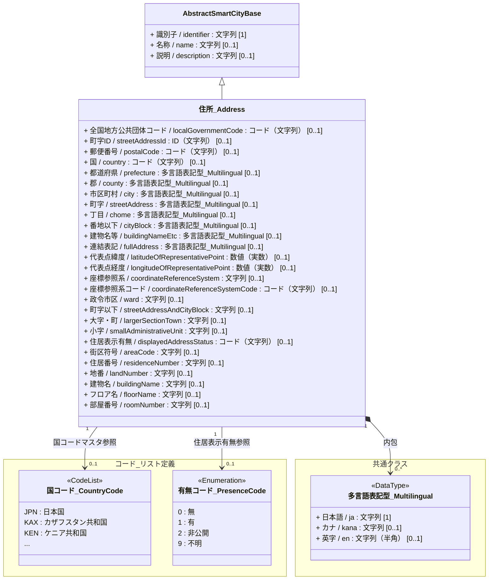

```mermaid
classDiagram
    direction TB

    %% 共通基底クラス
    class AbstractSmartCityBase {
        + 識別子 / identifier : 文字列 [1]
        + 名称 / name : 文字列 [0..1]
        + 説明 / description : 文字列 [0..1]
    }

    %% 住所クラス
    class 住所_Address {
        %% 外部の管理コード・ID類
        + 全国地方公共団体コード / localGovernmentCode : コード（文字列） [0..1]
        + 町字ID / streetAddressId : ID（文字列） [0..1]
        + 郵便番号 / postalCode : コード（文字列） [0..1]
        + 国 / country : コード（文字列） [0..1]
        
        %% --- 多言語構造化属性 ---
        + 都道府県 / prefecture : 多言語表記型_Multilingual [0..1]
        + 郡 / county : 多言語表記型_Multilingual [0..1]
        + 市区町村 / city : 多言語表記型_Multilingual [0..1]
        + 町字 / streetAddress : 多言語表記型_Multilingual [0..1]
        + 丁目 / chome : 多言語表記型_Multilingual [0..1]
        + 番地以下 / cityBlock : 多言語表記型_Multilingual [0..1]
        + 建物名等 / buildingNameEtc : 多言語表記型_Multilingual [0..1]
        + 連結表記 / fullAddress : 多言語表記型_Multilingual [0..1]
        
        %% --- 地理空間座標属性 ---
        + 代表点緯度 / latitudeOfRepresentativePoint : 数値（実数） [0..1]
        + 代表点経度 / longitudeOfRepresentativePoint : 数値（実数） [0..1]
        + 座標参照系 / coordinateReferenceSystem : 文字列 [0..1]
        + 座標参照系コード / coordinateReferenceSystemCode : コード（文字列） [0..1]

        %% --- 非多言語構造化属性 ---
        + 政令市区 / ward : 文字列 [0..1]
        + 町字以下 / streetAddressAndCityBlock : 文字列 [0..1]
        + 大字・町 / largerSectionTown : 文字列 [0..1]
        + 小字 / smallAdministrativeUnit : 文字列 [0..1]
        + 住居表示有無 / displayedAddressStatus : コード（文字列） [0..1]
        + 街区符号 / areaCode : 文字列 [0..1]
        + 住居番号 / residenceNumber : 文字列 [0..1]
        + 地番 / landNumber : 文字列 [0..1]
        + 建物名 / buildingName : 文字列 [0..1]
        + フロア名 / floorName : 文字列 [0..1]
        + 部屋番号 / roomNumber : 文字列 [0..1]
    }


    %% ---------------------------------------------------------
    %% コード・リスト定義クラス
    %% ---------------------------------------------------------
    %% マスターコードを参照する「全国地方公共団体コード」「郵便番号」「座標参照系コード」などは記載しない。
    namespace コード_リスト定義 {
        class 国コード_CountryCode <<CodeList>> {
            JPN : 日本国
            KAX : カザフスタン共和国
            KEN : ケニア共和国
            ...
            %% ※詳細はコードマスタ参照
        }

        class 有無コード_PresenceCode <<Enumeration>> {
            0 : 無
            1 : 有
            2 : 非公開
            9 : 不明
        }
    }

    %% ---------------------------------------------------------
    %% 共通パーツ（Components）
    %% ---------------------------------------------------------
    namespace 共通クラス {
    %% 共通の構造体（言語）
      class 多言語表記型_Multilingual <<DataType>> {
         + 日本語 / ja : 文字列 [1]
         + カナ / kana : 文字列 [0..1]
         + 英字 / en : 文字列（半角） [0..1]
      }
    }

    %% リレーション
    AbstractSmartCityBase <|-- 住所_Address
    住所_Address "1" --> "0..1" 国コード_CountryCode : 国コードマスタ参照
    住所_Address "1" --> "0..1" 有無コード_PresenceCode : 住居表示有無参照
    住所_Address "1" *--> "0..*" 多言語表記型_Multilingual : 内包
```