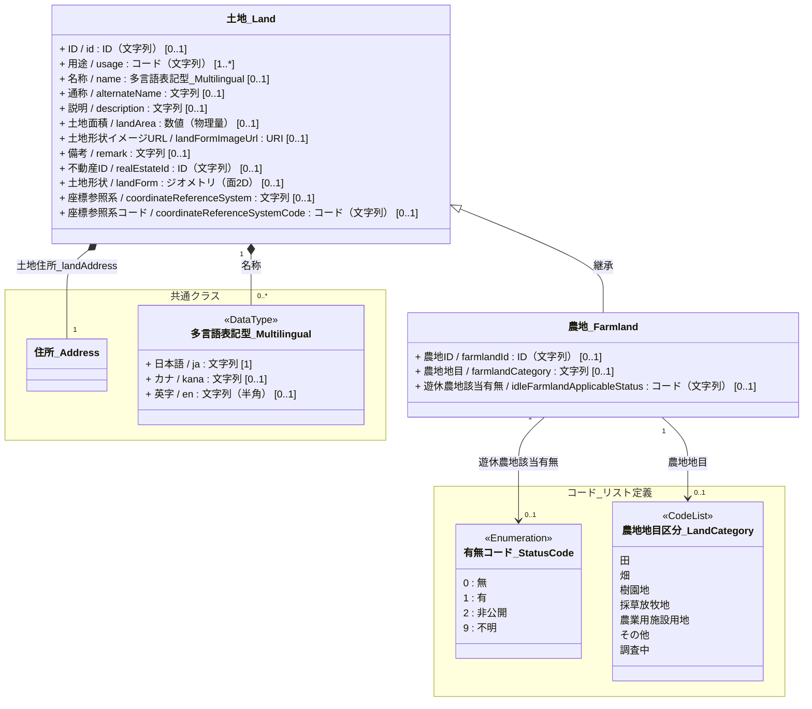

# 4.11 農地クラス図

農地モデルは共通基盤クラス `土地_Land` を継承する単一構成であるため、共通基盤として集約して定義します。

## 4.11.1 共通基盤

農地モデルに特化した固有の共通基盤クラスは存在しないため、共通基盤モデルである `土地_Land` を継承し、農地モデルを作成します。

```mermaid
classDiagram
    direction TB

    %% ---------------------------------------------------------
    %% 土地クラス（基本モデル）
    %% ---------------------------------------------------------
    class 土地_Land {
        + ID / id : ID（文字列） [0..1]
          %% 法務省の筆コード（登記所備付地図）等の土地識別子の利用を想定。または、法務省の不動産登記規則に基づく13桁の不動産番号
        + 用途 / usage : コード（文字列） [1..*]
          %% 国土交通省都市局の都市計画基礎調査実施要領の土地コード
        + 名称 / name : 多言語表記型_Multilingual [0..1]
        + 通称 / alternateName : 文字列 [0..1]
        + 説明 / description : 文字列 [0..1]
        + 土地面積 / landArea : 数値（物理量） [0..1]
          %% 単位: m2
        + 土地形状イメージURL / landFormImageUrl : URI [0..1]
        + 備考 / remark : 文字列 [0..1]
        + 不動産ID / realEstateId : ID（文字列） [0..1]
          %% ※国土交通省「不動産IDルールガイドライン」に準拠した17桁のコード
          %% （法務省の不動産登記規則に基づく13桁の不動産番号 ＋ 特定コード4桁）
        %% --- 地理空間座標属性 ---
        + 土地形状 / landForm : ジオメトリ（面2D） [0..1]
        + 座標参照系 / coordinateReferenceSystem : 文字列 [0..1]
        + 座標参照系コード / coordinateReferenceSystemCode : コード（文字列） [0..1] 
    }

    %% ---------------------------------------------------------
    %% 農地定義
    %% ---------------------------------------------------------
    class 農地_Farmland {
        + 農地ID / farmlandId : ID（文字列） [0..1]
          %% 農林水産省の筆ポリゴンID（農林水産省地理情報共通管理システム・eMAFF農地ナビ）を想定
        + 農地地目 / farmlandCategory : 文字列 [0..1]
          %% 農林水産省地理情報共通管理システム・eMAFF農地ナビの地目
        + 遊休農地該当有無 / idleFarmlandApplicableStatus : コード（文字列） [0..1]
          %% 有無コード参照
    }

    namespace 共通クラス {
        class 住所_Address

        %% 共通の構造体（言語）
        class 多言語表記型_Multilingual <<DataType>> {
            + 日本語 / ja : 文字列 [1]
            + カナ / kana : 文字列 [0..1]
            + 英字 / en : 文字列（半角） [0..1]
        }
    }

    %% ---------------------------------------------------------
    %% コード・リスト定義クラス
    %% ---------------------------------------------------------
    namespace コード_リスト定義 {
        class 有無コード_StatusCode <<Enumeration>> {
            0 : 無
            1 : 有
            2 : 非公開
            9 : 不明
        }
        class 農地地目区分_LandCategory <<CodeList>> {
          %% 農林水産省地理情報共通管理システム・eMAFF農地ナビの地目
            田
            畑
            樹園地
            採草放牧地
            農業用施設用地
            その他
            調査中
        }  
    }

    %% 汎化（継承関係）
    土地_Land <|-- 農地_Farmland : 継承

    %% コンポジション（関係性の定義）
    土地_Land *-- "1" 住所_Address : 土地住所_landAddress
    土地_Land "1" *-- "0..*" 多言語表記型_Multilingual : 名称

    %% 参照関係
    農地_Farmland "1" --> "0..1" 有無コード_StatusCode : 遊休農地該当有無
    農地_Farmland "1" --> "0..1" 農地地目区分_LandCategory : 農地地目
```

